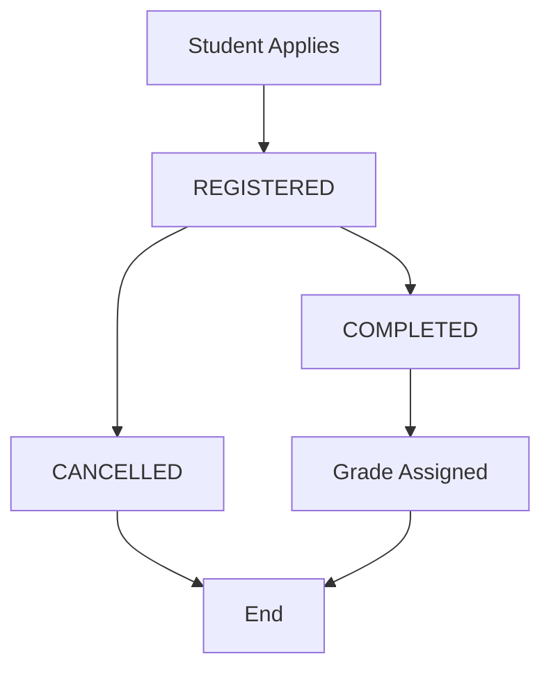

# Student Management API Documentation - Part 4

## Overview
This is Part 4 (Final) of the comprehensive Student Management API documentation, covering Class Management, Class Registration, and Registration History. These are the operational components that bring together students, courses, lecturers, and semesters into active learning sessions.

## Base URL
```
http://localhost:9000/api
```

---

## 1. Class Management

### 1.1 Add Class
**POST** `/classes`

Creates a new class session for a specific course, semester, and lecturer.

**Request Body:**
```json
{
  "classCode": "CS101-01",
  "maxStudents": 50,
  "schedule": "Thứ Hai - Thứ Tư 10:00-12:00",
  "room": "A101",
  "courseId": 1,
  "lecturerId": 1,
  "semesterId": 1
}
```

**Validation Rules:**
- `classCode`: Required, not blank, must be unique
- `maxStudents`: Required, must be greater than 0
- `schedule`: Required, not blank
- `room`: Required, not blank
- `courseId`: Required, must reference existing active course
- `lecturerId`: Required, must reference existing lecturer
- `semesterId`: Required, must reference existing semester

**Response:**
```json
{
  "status": 201,
  "message": "Success",
  "data": {
    "id": 1,
    "classCode": "CS101-01",
    "maxStudents": 50,
    "schedule": "Thứ Hai - Thứ Tư 10:00-12:00",
    "room": "A101",
    "courseId": 1,
    "courseCode": "CS101",
    "courseName": "Nhập môn Lập trình",
    "credits": 3,
    "facultyName": "Khoa Luật",
    "prerequisiteCourseCode": null,
    "prerequisiteCourseName": null,
    "lecturerId": 1,
    "lecturerName": "TS. Nguyễn Văn A",
    "semesterId": 1,
    "semesterName": 1,
    "createdDate": "2025-06-05T10:30:00",
    "updatedDate": "2025-06-05T10:30:00",
    "createdBy": "admin",
    "updatedBy": "admin"
  }
}
```

### 1.2 Get All Classes
**GET** `/classes`

Retrieves all classes with pagination support.

**Query Parameters:**
- `page` (integer, optional, default: 0): Page number
- `size` (integer, optional, default: 3): Page size

**Response:**
```json
{
  "status": 200,
  "message": "Success",
  "data": [
    {
      "id": 1,
      "classCode": "CS101-01",
      "maxStudents": 50,
      "schedule": "Thứ Hai - Thứ Tư 10:00-12:00",
      "room": "A101",
      "courseId": 1,
      "courseCode": "CS101",
      "courseName": "Nhập môn Lập trình",
      "credits": 3,
      "facultyName": "Khoa Luật",
      "prerequisiteCourseCode": null,
      "prerequisiteCourseName": null,
      "lecturerId": 1,
      "lecturerName": "TS. Nguyễn Văn A",
      "semesterId": 1,
      "semesterName": 1,
      "createdDate": "2025-06-05T10:30:00",
      "updatedDate": "2025-06-05T10:30:00",
      "createdBy": "admin",
      "updatedBy": "admin"
    },
    {
      "id": 2,
      "classCode": "CS102-01",
      "maxStudents": 40,
      "schedule": "Thứ Ba - Thứ Năm 14:00-16:00",
      "room": "B201",
      "courseId": 2,
      "courseCode": "CS102",
      "courseName": "Cấu trúc Dữ liệu",
      "credits": 3,
      "facultyName": "Khoa Luật",
      "prerequisiteCourseCode": "CS101",
      "prerequisiteCourseName": "Nhập môn Lập trình",
      "lecturerId": 2,
      "lecturerName": "TS. Trần Thị B",
      "semesterId": 1,
      "semesterName": 1,
      "createdDate": "2025-06-05T10:30:00",
      "updatedDate": "2025-06-05T10:30:00",
      "createdBy": "admin",
      "updatedBy": "admin"
    }
  ],
  "paginationInfo": {
    "page": 0,
    "size": 3,
    "totalElements": 10,
    "totalPages": 4,
    "hasNext": true,
    "hasPrevious": false
  }
}
```

### 1.3 Get Class by ID
**GET** `/classes/{classId}`

Retrieves a specific class by its ID.

**Path Parameters:**
- `classId` (integer, required): Class ID

**Response:**
```json
{
  "status": 200,
  "message": "Success",
  "data": {
    "id": 1,
    "classCode": "CS101-01",
    "maxStudents": 50,
    "schedule": "Thứ Hai - Thứ Tư 10:00-12:00",
    "room": "A101",
    "courseId": 1,
    "courseCode": "CS101",
    "courseName": "Nhập môn Lập trình",
    "credits": 3,
    "facultyName": "Khoa Luật",
    "prerequisiteCourseCode": null,
    "prerequisiteCourseName": null,
    "lecturerId": 1,
    "lecturerName": "TS. Nguyễn Văn A",
    "semesterId": 1,
    "semesterName": 1,
    "createdDate": "2025-06-05T10:30:00",
    "updatedDate": "2025-06-05T10:30:00",
    "createdBy": "admin",
    "updatedBy": "admin"
  }
}
```

---

## 2. Class Registration Management

### 2.1 Create Class Registration
**POST** `/class-registrations`

Registers a student for a specific class.

**Request Body:**
```json
{
  "studentId": "SV001",
  "classId": 1,
  "status": "REGISTERED"
}
```

**Validation Rules:**
- `studentId`: Required, not blank, must reference existing student
- `classId`: Required, must reference existing class
- `status`: Optional, defaults to "REGISTERED"

**Registration Status Enum:**
- `REGISTERED`: Student is enrolled in the class
- `CANCELLED`: Student cancelled the registration
- `COMPLETED`: Student completed the class

**Response:**
```json
{
  "status": 201,
  "message": "Data created",
  "data": {
    "id": 1,
    "status": "REGISTERED",
    "studentId": "SV001",
    "studentName": "Nguyễn Văn A",
    "classId": 1,
    "classCode": "CS101-01",
    "grade": null,
    "createdDate": "2025-06-05T10:30:00",
    "updatedDate": "2025-06-05T10:30:00",
    "createdBy": "admin",
    "updatedBy": "admin"
  }
}
```

### 2.2 Get All Class Registrations
**GET** `/class-registrations`

Retrieves all class registrations with pagination support.

**Query Parameters:**
- `page` (integer, optional, default: 0): Page number
- `size` (integer, optional, default: 3): Page size

**Response:**
```json
{
  "status": 200,
  "message": "Data retrieved",
  "data": [
    {
      "id": 1,
      "status": "REGISTERED",
      "studentId": "SV001",
      "studentName": "Nguyễn Văn A",
      "classId": 1,
      "classCode": "CS101-01",
      "grade": null,
      "createdDate": "2025-06-05T10:30:00",
      "updatedDate": "2025-06-05T10:30:00",
      "createdBy": "admin",
      "updatedBy": "admin"
    },
    {
      "id": 2,
      "status": "COMPLETED",
      "studentId": "SV002",
      "studentName": "Trần Thị B",
      "classId": 1,
      "classCode": "CS101-01",
      "grade": 8.5,
      "createdDate": "2025-06-05T10:30:00",
      "updatedDate": "2025-06-05T14:30:00",
      "createdBy": "admin",
      "updatedBy": "admin"
    }
  ],
  "paginationInfo": {
    "page": 0,
    "size": 3,
    "totalElements": 10,
    "totalPages": 4,
    "hasNext": true,
    "hasPrevious": false
  }
}
```

### 2.3 Get Class Registration by ID
**GET** `/class-registrations/{id}`

Retrieves a specific class registration by its ID.

**Path Parameters:**
- `id` (integer, required): Class Registration ID

**Response:**
```json
{
  "status": 200,
  "message": "Data retrieved",
  "data": {
    "id": 1,
    "status": "REGISTERED",
    "studentId": "SV001",
    "studentName": "Nguyễn Văn A",
    "classId": 1,
    "classCode": "CS101-01",
    "grade": null,
    "createdDate": "2025-06-05T10:30:00",
    "updatedDate": "2025-06-05T10:30:00",
    "createdBy": "admin",
    "updatedBy": "admin"
  }
}
```

### 2.4 Update Class Registration
**PATCH** `/class-registrations/{id}`

Updates a class registration status and/or grade.

**Path Parameters:**
- `id` (integer, required): Class Registration ID

**Request Body:**
```json
{
  "status": "COMPLETED",
  "grade": 8.5
}
```

**Validation Rules:**
- `status`: Required, must be valid RegistrationStatus
- `grade`: Optional, must be between 0 and 10, must be multiple of 0.5

**Grade Validation:**
- Valid grades: 0, 0.5, 1.0, 1.5, ..., 9.5, 10.0
- Grade is only set when status is "COMPLETED"

**Response:**
```json
{
  "status": 200,
  "message": "Data updated",
  "data": {
    "id": 1,
    "status": "COMPLETED",
    "studentId": "SV001",
    "studentName": "Nguyễn Văn A",
    "classId": 1,
    "classCode": "CS101-01",
    "grade": 8.5,
    "createdDate": "2025-06-05T10:30:00",
    "updatedDate": "2025-06-05T14:30:00",
    "createdBy": "admin",
    "updatedBy": "admin"
  }
}
```

---

## 3. Class Registration History Management

### 3.1 Add Class Registration History
**POST** `/class-registration-histories`

Records a history entry for class registration changes.

**Request Body:**
```json
{
  "action": "REGISTERED",
  "reason": "Đăng ký học phần",
  "classRegistrationId": 1
}
```

**Validation Rules:**
- `action`: Required, must be valid RegistrationStatus
- `reason`: Optional, descriptive text
- `classRegistrationId`: Required, must reference existing class registration

**Response:**
```json
{
  "status": 200,
  "message": "Add Class Registration History successfully",
  "data": {
    "id": 1,
    "action": "REGISTERED",
    "reason": "Đăng ký học phần",
    "classRegistrationId": 1,
    "classCode": "CS101-01",
    "studentId": "SV001",
    "createdBy": "admin",
    "updatedBy": "admin",
    "createdAt": "2025-06-05T10:30:00",
    "updatedAt": "2025-06-05T10:30:00"
  }
}
```

### 3.2 Test Endpoint (Development Only)
**GET** `/class-registration-histories/`

Simple test endpoint for development purposes.

**Response:**
```
"Hello World!"
```

---

## 4. Registration Workflow Examples

### 4.1 Complete Student Registration Flow
```bash
# 1. Student registers for a class
POST /api/class-registrations
{
  "studentId": "SV001",
  "classId": 1,
  "status": "REGISTERED"
}

# 2. Record registration history
POST /api/class-registration-histories
{
  "action": "REGISTERED",
  "reason": "Đăng ký học phần",
  "classRegistrationId": 1
}

# 3. Student completes the class (at end of semester)
PATCH /api/class-registrations/1
{
  "status": "COMPLETED",
  "grade": 8.5
}

# 4. Record completion history
POST /api/class-registration-histories
{
  "action": "COMPLETED", 
  "reason": "Hoàn thành học phần",
  "classRegistrationId": 1
}
```

### 4.2 Registration Cancellation Flow
```bash
# 1. Student cancels registration (before deadline)
PATCH /api/class-registrations/1
{
  "status": "CANCELLED"
}

# 2. Record cancellation history
POST /api/class-registration-histories
{
  "action": "CANCELLED",
  "reason": "Hủy đăng ký học phần do xung đột lịch học",
  "classRegistrationId": 1
}
```

### 4.3 Class Capacity Management
```bash
# Check current registrations vs capacity
GET /api/classes/1
# Response shows maxStudents: 50

GET /api/class-registrations?classId=1&status=REGISTERED
# Count active registrations to ensure capacity not exceeded
```

---

## 5. Business Rules and Constraints

### 5.1 Class Management Rules
- **Class Code Uniqueness**: Each class must have a unique class code
- **Room Scheduling**: Same room cannot be double-booked for overlapping times
- **Lecturer Availability**: Same lecturer cannot teach multiple classes at the same time
- **Semester Alignment**: Classes must be created within active semester periods
- **Course Prerequisites**: Students must complete prerequisite courses before registration

### 5.2 Registration Rules
- **Capacity Limits**: Cannot exceed maxStudents for any class
- **Duplicate Prevention**: One student cannot register for the same class multiple times
- **Prerequisites Check**: Student must have completed prerequisite courses
- **Semester Deadlines**: Registrations must occur before semester's lastCancelDate
- **Status Transitions**: Valid status transitions must be followed

### 5.3 Grading Rules
- **Grade Range**: Grades must be between 0.0 and 10.0
- **Grade Precision**: Grades must be multiples of 0.5 (0, 0.5, 1.0, 1.5, ..., 10.0)
- **Completion Requirement**: Grades can only be assigned when status is "COMPLETED"
- **Grade Immutability**: Once assigned, grades should not be changed without proper authorization

### 5.4 History Tracking Rules
- **Audit Trail**: All registration changes must be recorded in history
- **Immutable Records**: History records cannot be modified once created
- **Timestamp Accuracy**: All changes must be timestamped accurately
- **User Attribution**: All changes must be attributed to specific users

---

## 6. Registration Status Lifecycle



**Status Definitions:**
- **REGISTERED**: Student is actively enrolled in the class
- **CANCELLED**: Student withdrew from the class (before completion)
- **COMPLETED**: Student finished the class (eligible for grading)

---

## 7. Error Handling

### 7.1 Class Management Errors

**Class Not Found (404)**
```json
{
  "status": 404,
  "message": "Class not found"
}
```

**Duplicate Class Code (409)**
```json
{
  "status": 409,
  "message": "Class code already exists"
}
```

**Invalid Course Reference (400)**
```json
{
  "status": 400,
  "message": "Course not found or inactive"
}
```

**Lecturer Not Available (409)**
```json
{
  "status": 409,
  "message": "Lecturer is not available at the specified time"
}
```

### 7.2 Registration Errors

**Class Full (409)**
```json
{
  "status": 409,
  "message": "Class has reached maximum capacity"
}
```

**Duplicate Registration (409)**
```json
{
  "status": 409,
  "message": "Student is already registered for this class"
}
```

**Prerequisites Not Met (400)**
```json
{
  "status": 400,
  "message": "Student has not completed prerequisite courses"
}
```

**Registration Deadline Passed (400)**
```json
{
  "status": 400,
  "message": "Registration deadline has passed for this semester"
}
```

**Invalid Grade (400)**
```json
{
  "status": 400,
  "message": "Grade must be a multiple of 0.5 and between 0 and 10"
}
```

### 7.3 History Errors

**Invalid Registration Reference (400)**
```json
{
  "status": 400,
  "message": "Class registration not found"
}
```

**Invalid Action Status (400)**
```json
{
  "status": 400,
  "message": "Invalid registration status"
}
```

---

## Summary

This completes the comprehensive Student Management API documentation covering all four parts:

**Part 1**: Foundation entities (Faculty, Program, Student Status, Email Domain, Student Status Rules)
**Part 2**: Core entities (Student, Lecturer, File Transfer, Translation)
**Part 3**: Academic structure (Course, Semester)
**Part 4**: Operations (Class, Registration, History)

The system provides a complete student management solution with:
- **30+ API endpoints** across 4 major functional areas
- **Comprehensive validation** and business rule enforcement
- **Full audit trail** with history tracking
- **Robust error handling** with specific error codes
- **Scalable architecture** with pagination and performance optimization
- **Data integrity** with proper referential constraints
- **Flexible grading system** with Vietnamese academic standards
- **Multi-language support** through translation services

The API supports the complete student lifecycle from enrollment through graduation, with proper academic workflow management and comprehensive reporting capabilities.